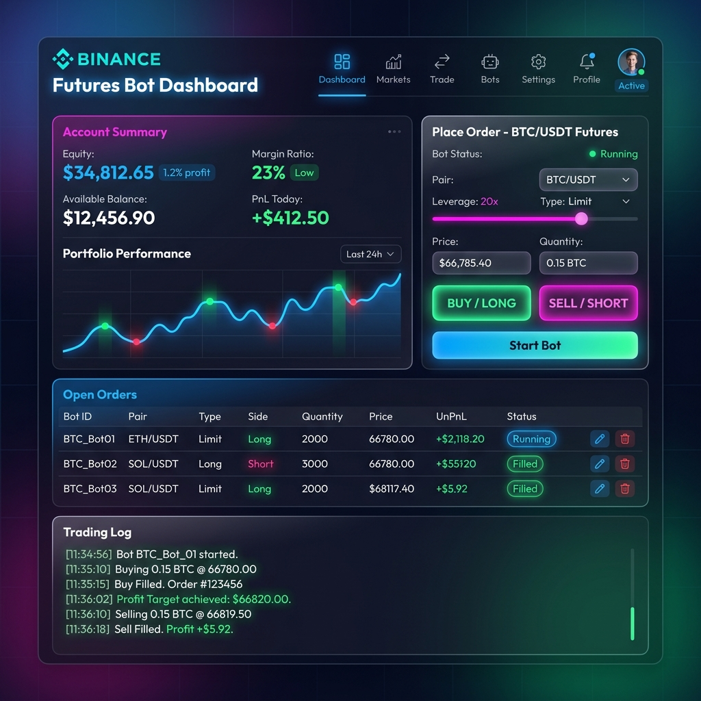

# 🤖 Binance Futures Testnet – Trading Bot

A clean, well-structured Python CLI application for placing orders on the **Binance USDT-M Futures Testnet**.

---

## Project Structure

```
trading_bot/
├── bot/
│   ├── __init__.py          # Package exports
│   ├── client.py            # Low-level Binance REST client (signing, HTTP, error handling)
│   ├── orders.py            # Order placement logic + result formatting
│   ├── validators.py        # Input validation (raises ValueError with clear messages)
│   └── logging_config.py   # Rotating file + console log setup
├── cli.py                   # CLI entry point (argparse)
├── sample_logs/
│   └── trading_bot.log      # Sample log: market, limit, stop-market, validation error
├── .env.example             # Template for API credentials
├── requirements.txt
└── README.md
```

---

## Setup

### 1. Get Testnet API Credentials

1. Visit [https://testnet.binancefuture.com](https://testnet.binancefuture.com)
2. Log in / register (GitHub login supported)
3. Navigate to **API Key** and generate a key pair
4. Copy your **API Key** and **Secret Key**

### 2. Install Dependencies

```bash
# Create and activate a virtual environment (recommended)
python3 -m venv .venv
source .venv/bin/activate        # Windows: .venv\Scripts\activate

# Install packages
pip install -r requirements.txt
```

### 3. Configure Credentials

```bash
cp .env.example .env
```

Edit `.env` and fill in your keys:

```env
BINANCE_API_KEY=your_testnet_api_key_here
BINANCE_API_SECRET=your_testnet_api_secret_here
LOG_LEVEL=INFO
```

> ⚠️ Never commit `.env` to version control. It is listed in `.gitignore`.

---

## Running the Bot

All commands are run from the project root.

### Place a Market Order

```bash
# BUY 0.001 BTC at market price
python cli.py place --symbol BTCUSDT --side BUY --type MARKET --qty 0.001

# SELL 0.01 ETH at market price
python cli.py place --symbol ETHUSDT --side SELL --type MARKET --qty 0.01
```

### Place a Limit Order

```bash
# SELL 0.001 BTC when price reaches 70,000
python cli.py place --symbol BTCUSDT --side SELL --type LIMIT --qty 0.001 --price 70000

# BUY 0.001 BTC at 60,000 (GTC)
python cli.py place --symbol BTCUSDT --side BUY --type LIMIT --qty 0.001 --price 60000 --tif GTC
```

### Place a Stop-Market Order *(Bonus)*

```bash
# Protective stop: sell if price drops to 65,000
python cli.py place --symbol BTCUSDT --side SELL --type STOP_MARKET --qty 0.001 --stop-price 65000
```

### View Account Summary

```bash
python cli.py account
```

### List Open Orders

```bash
python cli.py orders                    # all symbols
python cli.py orders --symbol BTCUSDT  # filtered
```

### Print Raw API Response

Append `--raw` to any `place` command:

```bash
python cli.py place --symbol BTCUSDT --side BUY --type MARKET --qty 0.001 --raw
```

### Launch the Web UI Dashboard *(Bonus)*

To launch the premium glassmorphic local web dashboard:

```bash
# Start the local UI server
python gui.py
```

Then open **[http://localhost:8000](http://localhost:8000)** in your browser.

The web UI provides a visual dashboard for:
- Live Account Balance, Available Balance, and Unrealized P&L monitoring.
- Interactive order placement (Market, Limit, and Stop-Market orders) with real-time UI validations.
- Open Orders table with sync options.
- Dynamic scrolling stream of your bot's **live logs** (`logs/trading_bot.log`).



---

## Example Output

```
───────────────────────────────────────────────
  ORDER REQUEST SUMMARY
───────────────────────────────────────────────
  Symbol     : BTCUSDT
  Side       : BUY
  Type       : MARKET
  Quantity   : 0.001

┌─────────────────────────────────────────────┐
│              ORDER CONFIRMATION              │
└─────────────────────────────────────────────┘
  Order ID       : 4751823901
  Client OID     : testbot_mkt_20250614
  Symbol         : BTCUSDT
  Side           : BUY
  Type           : MARKET
  Status         : FILLED
  Orig Qty       : 0.001
  Executed Qty   : 0.001
  Avg Fill Price : 67482.30

✅  Order submitted successfully.
```

---

## Logging

Logs are written to `logs/trading_bot.log` (rotating, max 5 MB, 3 backups).

Each entry records:

| What | Detail |
|------|--------|
| Outgoing requests | endpoint, all non-signature params, timestamp |
| API responses | full JSON payload at DEBUG level |
| Validation errors | human-readable message at WARNING |
| API errors | Binance error code + message at ERROR |
| Unexpected errors | full traceback at EXCEPTION |

Console output only shows WARNING and above to keep the CLI clean.

To see debug-level output (full request/response bodies):

```env
LOG_LEVEL=DEBUG
```

Sample logs for a market order, limit order, stop-market order, and a validation error are provided in `sample_logs/trading_bot.log`.

---

## Assumptions & Design Notes

| Assumption | Rationale |
|-----------|-----------|
| Credentials via `.env` | Standard 12-factor practice; avoids CLI credential leakage in shell history |
| No `python-binance` library | Uses `requests` directly to keep dependencies minimal and make the signing/auth logic explicit and auditable |
| `STOP_MARKET` as bonus type | Simplest additional order type; requires only `stopPrice`, no limit price needed |
| `recvWindow = 5000 ms` | Default Binance recommendation; can be increased for slow networks |
| Decimal arithmetic | All quantities/prices use Python `Decimal` to avoid float precision issues |
| Validation before API call | Catches obvious errors locally before burning a network round-trip |

---

## Error Handling

| Error type | Handling |
|------------|----------|
| Missing/blank credentials | Exits with clear message before any API call |
| Invalid user input (bad symbol, missing price, etc.) | Caught by `validators.py`, printed cleanly, non-zero exit |
| Binance API errors (4xx/5xx) | `BinanceAPIError` raised, code + message printed |
| Network failures / timeouts | `requests.RequestException` propagated, logged, printed |
| Unexpected exceptions | Logged with full traceback, printed, non-zero exit |

---

## Requirements

- Python 3.8+
- `requests>=2.31.0`
- `python-dotenv>=1.0.0`
